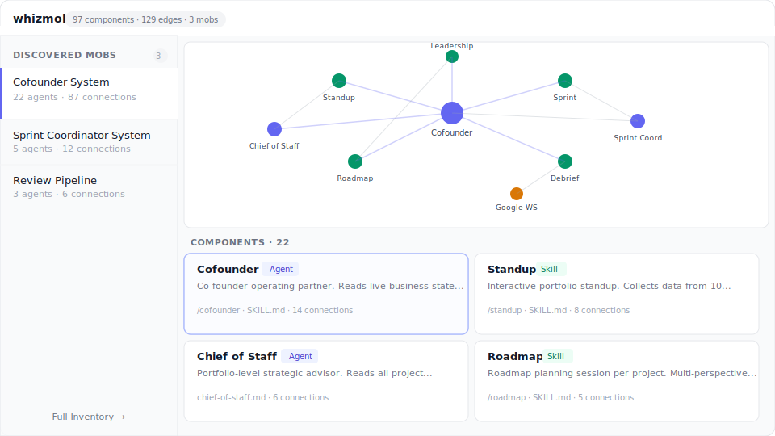

# whizmob

**See what AI agent systems you've actually built.**

If you use Claude Code, Cursor, or Codex, you've probably created agents, skills, MCP integrations, and project configs without thinking of them as a system. Whizmob scans your setup, figures out which pieces work together, and shows you the result as an interactive graph.

## Prerequisites

Before you start, make sure you have:

- **Node.js 20 or newer** — check with `node --version`
- **macOS users**: Xcode command-line tools — run `xcode-select --install` if you haven't already (needed to compile a native database module)
- **Linux users**: `build-essential` and `python3` packages
- **At least one AI tool installed**: Claude Code (`~/.claude/`), Cursor (`~/.cursor/`), or Codex (`~/.codex/`)

## Quick start

Run these two commands in your terminal, one after the other:

```bash
npx whizmob scan
```

This scans your machine for AI agents, skills, and integrations. It takes about 30 seconds. You'll see output like:

```
[whizmob] DB updated: 42 total, +42 added, -0 removed
[whizmob] New: code-reviewer, test-runner, deploy-agent, standup, roadmap, ...
[whizmob] Edges: 67 inferred

[whizmob] Found 42 components across 2 platforms.

  What's next:
    whizmob demo --open    Open an interactive mob inspector in your browser
    whizmob dashboard      Launch the full dashboard at localhost:3333
    whizmob stats          Quick inventory summary
    whizmob roster -s <q>  Search your agents by name or purpose
```

Then open the interactive viewer:

```bash
npx whizmob demo --open
```

This generates an HTML file and opens it in your browser. You'll see your agents laid out as a force-directed graph, grouped into **mobs** — clusters of components that reference each other.

No accounts, no API keys, no config. Everything stays on your machine.

## What it finds

Whizmob looks in three places:

| Location | What it finds |
|----------|--------------|
| `~/.claude/` | Agents, skills, MCP servers, settings |
| `~/.cursor/` | Agents, MCP servers, settings |
| `~/.codex/` | Skills |

It also scans project directories under `~/Documents/` for per-project `.claude/` configs.

After finding your components, it reads their source files to detect **connections** between them — one agent referencing another's config file, a skill invoking another skill by name, or two components reading the same shared state file. Components with connections get grouped into **mobs**.

## The dashboard

For a richer experience than the static demo, run:

```bash
npx whizmob dashboard
```

Then open `http://localhost:3333`. The dashboard has:

- **Inspector** (home page) — your discovered mobs as interactive graphs
- **Inventory** (`/agents`) — flat searchable list of every component
- **Import** — install mob bundles from other machines

<p align="center">
  
</p>

## Moving your agents to another machine

If you want to take your agent setup from one machine and install it on another, there are three steps.

### Step 1: Define a mob (source machine)

First, tell whizmob which agents you want to bundle together:

```bash
npx whizmob scan
npx whizmob mob define "my-setup" --desc "My code review agents" --add code-reviewer test-runner linter
```

You can see what's in it with:

```bash
npx whizmob mob show my-setup
```

### Step 2: Export (source machine)

```bash
npx whizmob export my-setup
```

This creates a folder at `~/.whizmob/exports/my-setup/` containing your agents as portable files. Whizmob automatically:

- Rewrites absolute paths (like `/Users/yourname/...`) into generic placeholders
- Strips secrets and API keys
- Bootstraps memory files (keeps the structure, clears the data)

Copy that folder to the new machine however you like — git, USB drive, AirDrop, cloud storage.

### Step 3: Import (new machine)

On the new machine, first preview what will be installed:

```bash
npx whizmob import ./path/to/my-setup --dry-run
```

If it looks right, install for real:

```bash
npx whizmob import ./path/to/my-setup
```

Whizmob will prompt you for any values that differ between machines (like your home directory path or workspace location). Your agents are now installed in `~/.claude/` on the new machine.

### Updating later

If you change your agents on the source machine and want to sync those changes to the other machine:

**Source machine:**
```bash
npx whizmob export my-setup
```

**Other machine** (after copying the updated export):
```bash
npx whizmob update ./path/to/my-setup
```

The update command compares each file three ways:

- **Only changed upstream** (you didn't edit it locally) — auto-applies the update
- **Only changed locally** (upstream didn't change) — keeps your local version
- **Changed on both sides** — shows you the diff so you can decide

## All commands

```bash
# Discover your agents
npx whizmob scan                  # Scan all platforms
npx whizmob stats                 # Show a summary of what was found

# Visualize
npx whizmob demo --open           # Open interactive graph in browser
npx whizmob dashboard             # Launch full dashboard at localhost:3333

# Search
npx whizmob roster -s "deploy"    # Search agents by name or purpose

# Manage mobs
npx whizmob mob list              # List your defined mobs
npx whizmob mob show my-setup     # Show details of a mob
npx whizmob mob define "name" --add agent1 agent2   # Create a new mob

# Move agents between machines
npx whizmob export my-setup       # Bundle a mob for transfer
npx whizmob import ./bundle       # Install a bundle on this machine
npx whizmob update ./bundle       # Sync changes from an updated bundle
npx whizmob import --list         # Show pre-built mobs that ship with whizmob
```

## How it works

Everything runs locally. No server, no cloud, no accounts.

- The **scanner** reads config files from `~/.claude/`, `~/.cursor/`, and `~/.codex/`
- **Edge inference** reads source files to find references between components
- **Clustering** groups connected components into mobs using graph traversal
- A **SQLite database** at `~/.whizmob/whizmob.db` stores everything
- **Exports** are plain folders with a `manifest.json` — no binaries, git-friendly

## Troubleshooting

**`npx whizmob scan` fails with a native module error:**
You're probably missing build tools. On macOS: `xcode-select --install`. On Linux: `sudo apt install build-essential python3`. Then try again.

**Scan finds 0 components:**
Whizmob looks in `~/.claude/`, `~/.cursor/`, and `~/.codex/`. If you don't have any of these tools installed, there's nothing to find. Install [Claude Code](https://docs.anthropic.com/en/docs/claude-code), create an agent or skill, then scan again.

**Demo shows "No mobs discovered yet":**
Your components exist but don't reference each other yet. Mobs appear when agents invoke skills, share state files, or reference each other's configs. The full inventory is still available via `npx whizmob dashboard` at `/agents`.

## License

MIT
